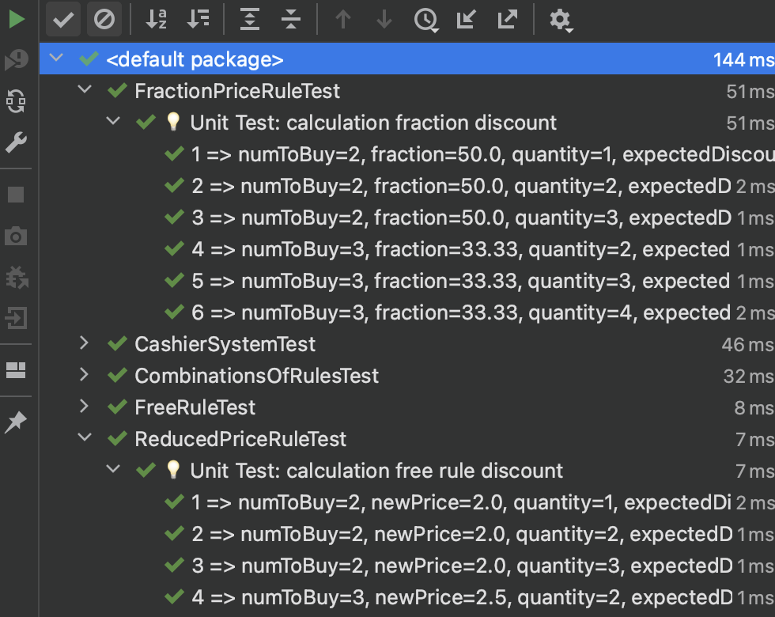

# Cashier System (Test Exam)

Simple cashier function that adds products to a cart and displays the total price.

## Agenda

The following products are registered:

| Product Code  | Product Name                                                     | Price |
|---------------|------------------------------------------------------------------|-------|
| GR1 | Green Tea| £3.11 |
| SR1 | Strawberries |£5.00|
| CF1 | Coffee|£11.23|

## Special Rules
* Buy one get one free
* Buy > N products, pay X price per product
* Buy > N products, pay X% of the original price

## Products and Discount Rules

The project doesn't connect to a database, it reads both the products and rules from a YAML file.

The default location of the file is priv/assets/products.yml and priv/assets/rules.yml, this can be changed in the Configuration.

Currently there are only 3 types of configurable discount rules:
* FreeRule (buy N get N free)
* ReducedPriceRule (buy more than N pay a different price)
* FractionPriceRule (buy more than N, pay a percentage of the original price)


## Requirements

* Install IntelliJ IDEA (or any other IDE)
  https://www.jetbrains.com/idea/download/
* Java JDK_8 (for arm64 or intel arch.)  
  https://adoptium.net/temurin/archive
* Maven
  https://maven.apache.org/download.cgi
* Allure (optional)
  https://github.com/allure-framework/allure2/archive/2.17.3.zip

## YAML Rules
```bash
priv/assets/products.yml
```
```bash
priv/assets/rules.yml
```

## CLI Output example

To execute application, please run a CashierSystem through IDE 
or with:
```bash
java -jar CashSystem-1.0-SNAPSHOT.jar
```

```bash
 ************** CASHIER SIMPLE SYSTEM **************
Enter product code or type 'done' to finish: GR1
Enter quantity of product(s): 3
Product code 'GR1' with '3' quantity added into the basket
Enter product code or type 'done' to finish: SR1
Enter quantity of product(s): 3
Product code 'SR1' with '3' quantity added into the basket
Enter product code or type 'done' to finish: CF1
Enter quantity of product(s): 3
Product code 'CF1' with '3' quantity added into the basket
Enter product code or type 'done' to finish: done
----------------------------------------------------
Price without discount: £15.00
Price without discount: £24.33
Price without discount: £58.02
Was applied the following discount: FreeRule
Was applied the following discount: FractionPriceRule
Was applied the following discount: ReducedPriceRule
Total discount: £21.46
************** TOTAL BILL *************************
Final price: £36.57   
```
## Tests
Whole tests contains under
```bash
src/test
```


## Author

- [@AlexanderFrost](https://github.com/AlexanderFrost)

## Feedback

If you have any feedback, please reach out to us at frostik6@gmail.com
